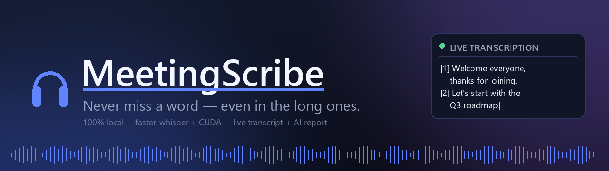
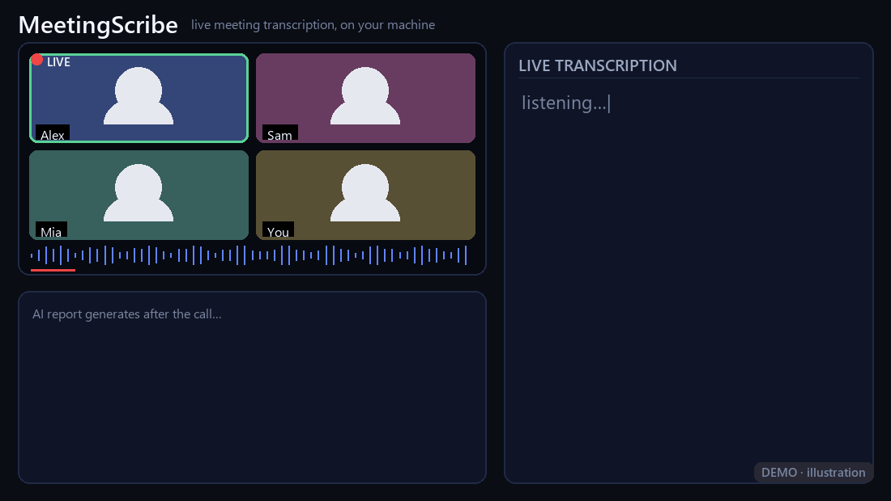

<div align="center">



# 🎧 MeetingScribe

### Got one of *those* never-ending meetings coming up? 😅 Let your GPU take the notes.


*Local, real-time meeting transcription for Windows. Capture system audio, transcribe live with*
*[faster-whisper](https://github.com/SYSTRAN/faster-whisper) on CUDA, separate speakers, and get an AI meeting report.*
**No cloud. No API bill** *(unless you want one).*

[**🚀 Quickstart**](#-quickstart-3-steps) · [**🎬 Demo**](#-demo) · [**🛠️ Usage**](#️-real-world-usage) · [**🔑 Config**](#-configuration-and-secrets) · [**📖 Docs**](DOCUMENTATION.md)

</div>

---

## ✨ What it does

- 🎙️ **Records system audio** (Zoom/Teams/Meet/YouTube — whatever plays) — or your mic with `--mic`.
- ⚡ **Live transcription** with faster-whisper `large-v3` on your GPU. No chunk-grid jankiness — dynamic voice-activity segments.
- 🧑‍🤝‍🧑 **Speaker separation** via SpeechBrain embeddings (with a graceful fallback).
- 📺 **Live "TV screen"** — a big window that streams the transcript in real time while the video plays next to it.
- 🤖 **AI report** — pipes the raw transcript through an LLM (OpenAI-compatible, local Ollama, or your own hosted endpoint) and writes a full report, a dialog version, and an ultra-short protocol.
- 💸 **Free by default** — everything runs locally. The LLM step is optional.

---

## 🚀 Quickstart (3 steps)

```powershell
# 1) Setup
python -m venv .venv
.\.venv\Scripts\Activate.ps1
pip install -r requirements.txt

# 2) Find your audio device index (do this once)
python demo.py --list-devices

# 3) Run the demo — then hit play on a YouTube video
python demo.py --device-index 13
```

A big **Live Transcription** window pops up and fills with text as the video plays. After 180 seconds (override with `--duration`) you get the recording + transcript + AI report in a fresh `meetings/<timestamp>/` folder.

> 💡 **No NVIDIA GPU?** faster-whisper falls back to CPU automatically — just slower. Speaker separation also falls back gracefully.

---

## 🎬 Demo

Play a YouTube video → MeetingScribe transcribes it live on the "TV screen" → transcript + AI report appear next to it.

<!-- TODO @niklas: drop your screen recording here. Suggested: record demo.py running
     next to a playing YouTube video, export as docs/demo.gif (or an .mp4), then replace
     the line below with:     -->


*(Demo clip coming soon.)*

---

## 🛠️ Real-world usage

The way this was actually used day-to-day (long meeting, system audio, hosted LLM report):

```powershell
python meetingscribe_hosted.py --output-loopback --device-index 13 --duration 7000
```

Plain local-only run (no hosted LLM):

```powershell
python meetingscribe.py --output-loopback --device-index 13 --duration 7000
```

With a local Ollama model for the report (no API key needed):

```powershell
python meetingscribe.py --output-loopback --device-index 13 --duration 3600 `
  --llm-finalize --llm-api-base http://localhost:11434/v1 --llm-model qwen2.5:14b-instruct
```

Mic instead of system audio:

```powershell
python meetingscribe.py --mic --duration 600
```

### Outputs (per session, in `meetings/<timestamp>/`)

| File | What |
|------|------|
| `meeting.wav` | the raw recording |
| `meeting_raw.json` | raw transcription data (source of truth) |
| `meeting_report_long.md` | full AI report |
| `meeting_report_dialog.md` | dialog / multi-speaker version |
| `meeting_protocol_short.md` | ultra-short protocol |
| `meeting_speakers.jsonl` | per-segment speaker + confidence |

### Handy flags

| Flag | Meaning |
|------|---------|
| `--list-devices` | print all audio devices and exit |
| `--output-loopback` | capture system audio (recommended) |
| `--mic` | capture microphone instead |
| `--device-index N` | exact device from `--list-devices` |
| `--duration N` | recording length in seconds |
| `--tv-window` | show the live "TV screen" |
| `--llm-finalize` | run the LLM report step |
| `--llm-api-base` / `--llm-model` | point the LLM step anywhere OpenAI-compatible |

---

## 🔑 Configuration and secrets

> Do this before the optional LLM report step.


The transcription works with **zero config**. The optional **AI report** step needs an LLM endpoint. Secrets and local config are **gitignored** and never committed — so you set them up yourself:

1. **For OpenAI / any OpenAI-compatible API or local Ollama:**
   Copy the env template and fill it in:
   ```powershell
   copy .env.example .env
   ```
   Set `OPENAI_API_KEY` (or just point `--llm-api-base` at `http://localhost:11434/v1` for Ollama — no key needed).

2. **For the hosted-LLM variant (`meetingscribe_hosted.py`):**
   It reads its key from either the `DIZ_AI_KEY` environment variable or an `apikey.txt` file in the project root. Create your own:
   ```powershell
   copy apikey.txt.example apikey.txt
   ```
   …then paste your real key into `apikey.txt`. You can override the endpoint and model via `DIZ_AI_BASE` / `DIZ_AI_MODEL` (or the `--llm-api-base` / `--llm-model` flags). The built-in defaults point at a private internal endpoint that **won't be reachable for you** — set your own.

> ⚠️ **Never commit `apikey.txt` or `.env`.** They're in `.gitignore` for a reason. If you ever leak a key, rotate it immediately.

---

## 📦 Requirements

- Windows (WASAPI loopback for system audio)
- Python 3.11+
- NVIDIA GPU + CUDA recommended (CPU works, slower)
- See [requirements.txt](requirements.txt)

```powershell
pip install -r requirements.txt
```

---

## 🧩 Project layout

| File | Role |
|------|------|
| `meetingscribe.py` | **run this** — launcher for the engine |
| `meetingscribe_core.py` | the engine (recording, transcription, speakers, reports, LLM) |
| `meetingscribe_hosted.py` | launcher with hosted-LLM defaults |
| `demo.py` | one-click demo (loopback + live TV window + short run) |
| `diagnose_hosted_llm.py`, `llm_api_smoke_test.py`, `retrofit_hosted_llm_dataset.py` | hosted-LLM utilities |

---

## 📖 Deep dive

Want the full, plain-language walkthrough of how it all works (recording →
Whisper → segmentation → speaker diarization → reports → optional AI)?
See [DOCUMENTATION.md](DOCUMENTATION.md) (in German).

---

## License

[MIT](LICENSE) — do what you want, just keep the notice. Have fun. 🎉

---

<div align="center">

**Stay in the conversation — let your GPU keep the notes.** 🎧

If MeetingScribe got you through one marathon meeting in one piece, drop a ⭐

</div>
